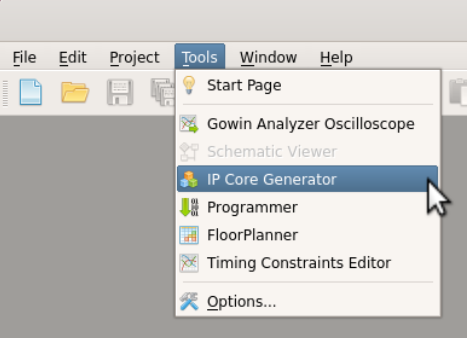
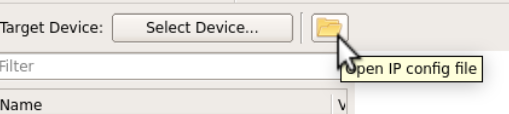
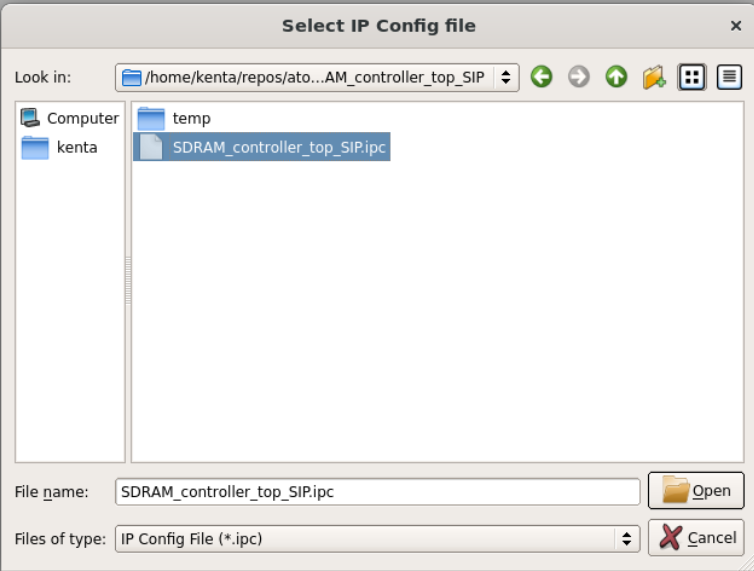
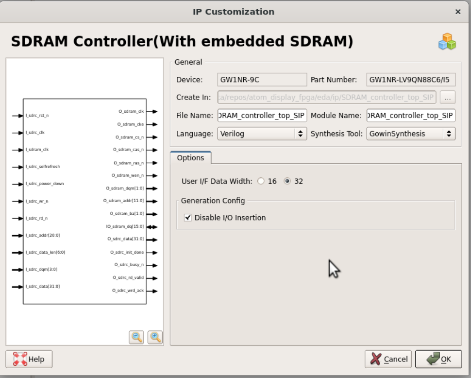
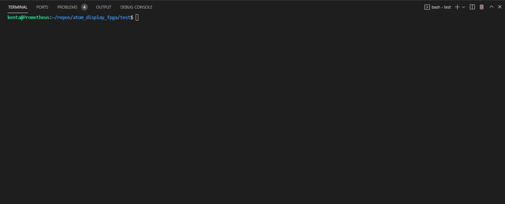

# ATOM Display FPGA Design

## 概要

本リポジトリには、M5Stack社が製造・販売している [`ATOM Display`](https://docs.m5stack.com/en/atom/atom_display) に搭載されているFPGA上の論理回路のソースおよび合成手順が含まれている。

ATOM Displayに搭載されているFPGAはGOWIN社の `GW1NR-LV9QN88` であり、GOWIN社から提供される GOWIN EDA ツールを用いて論理合成、配置配線、ビットストリームの生成を行うことにより、付属のテストコードと結合して、生成したビットストリームを動かすことができる。

## 必要なもの

現在のところLinux環境上でのみ、リポジトリ内のビルドスクリプトの動作を確認している。
また、以下のツールが使える状態になっている必要がある。

* Chisel 3.4.3が動作する環境
  * https://github.com/chipsalliance/chisel3/blob/master/SETUP.md
* GOWIN EDA v1.9.8
  * https://www.gowinsemi.com/ja/support/download_eda/
* PlatformIO
  * https://docs.platformio.org/en/latest/core/installation.html

## デザインの合成

### サブモジュールの取得

このリポジトリをクローンする際に `--recursive` を指定していない場合、以下のコマンドでサブモジュールを取得する。

```
git submodule update --init --recursive
```

### Chiselデザインのエラボレーション

デザインを合成するには、まずはChiselのデザインからVerilog HDLを生成する必要がある。
以下のコマンドを実行すると、Scalaのビルドツールである `sbt` を起動して、ATOM Display用のデザインのエラボレーションを行い、
結果として `rtl/m5stach_hdmi/video_generator.v` を出力する。


* コマンド 

```shell
sbt "project atom_display; runMain system.ElaborateM5StackHDMI"
```

* 実行結果

```
[info] welcome to sbt 1.5.4 (Ubuntu Java 11.0.13)
[info] loading global plugins from /home/kenta/.sbt/1.0/plugins
[info] loading settings for project atom_display_fpga-build-build from metals.sbt ...
[info] loading project definition from /home/kenta/repos/atom_display_fpga/project/project
[info] loading settings for project atom_display_fpga-build from metals.sbt ...
[info] loading project definition from /home/kenta/repos/atom_display_fpga/project
[success] Generated .bloop/atom_display_fpga-build.json
[success] Total time: 0 s, completed Jan 13, 2022, 4:00:10 AM
[info] loading settings for project root from build.sbt ...
[info] loading settings for project fpga_samples from build.sbt ...
[info] set current project to root (in build file:/home/kenta/repos/atom_display_fpga/)
[info] set current project to atom_display (in build file:/home/kenta/repos/atom_display_fpga/)
[info] running system.ElaborateM5StackHDMI 
Elaborating design...
Done elaborating.
[success] Total time: 5 s, completed Jan 13, 2022, 4:00:15 AM
```

### IPの再生成

`eda/ip` ディレクトリにあるGOWIN IPの定義ファイルから、GOWIN IPの合成用ファイルを再生成する。

GOWIN EDAのGUIを起動し、IP Generatorから `eda/ip/SDRAM_controller_top_SIP/SDRAM_controller_top_SIP.ipc` および `eda/ip/sdram_rpll/sdram_rpll.ipc` を開き、立ち上がったウィザードでそのままOKを押す。









### 論理合成

`eda/atomdisplay` に移動して `make` を実行すると、GOWIN EDAを使って論理合成を行い、ビットストリームを生成する。

また、M5GFXにてビットストリームを取り扱うために生成されたビットストリームをRLEにて圧縮する。

* コマンド

```shell
cd eda/atomdisplay
make
```

* 実行結果

```
gw_sh ./project.tcl atomdisplay
*** GOWIN Tcl Command Line Console  *** 
current device: GW1NR-9C  GW1NR-LV9QN88C6/I5
add new file: "/home/kenta/repos/atom_display_fpga/atom_display/rtl/m5stack_hdmi/video_generator.v"
add new file: "/home/kenta/repos/atom_display_fpga/eda/ip/SDRAM_controller_top_SIP/SDRAM_controller_top_SIP.v"
add new file: "/home/kenta/repos/atom_display_fpga/eda/ip/sdram_rpll/sdram_rpll.v"
add new file: "/home/kenta/repos/atom_display_fpga/eda/src/top.sv"
add new file: "/home/kenta/repos/atom_display_fpga/eda/src/atomdisplay.cst"
add new file: "/home/kenta/repos/atom_display_fpga/eda/src/m5stack_display.sdc"
GowinSynthesis start
Running parser ...
...
[100%] Power analysis completed
Generate file "/home/kenta/repos/atom_display_fpga/eda/atomdisplay/impl/pnr/atomdisplay.power.html" completed
Generate file "/home/kenta/repos/atom_display_fpga/eda/atomdisplay/impl/pnr/atomdisplay.pin.html" completed
Generate file "/home/kenta/repos/atom_display_fpga/eda/atomdisplay/impl/pnr/atomdisplay.rpt.html" completed
Generate file "/home/kenta/repos/atom_display_fpga/eda/atomdisplay/impl/pnr/atomdisplay.rpt.txt" completed
Generate file "/home/kenta/repos/atom_display_fpga/eda/atomdisplay/impl/pnr/atomdisplay.tr.html" completed
Thu Jan 13 04:14:21 2022

python3 ../../script/fs2rle.py impl/pnr/atomdisplay.fs impl/pnr/atomdisplay.rle
```

### テストコードのビルドと実行

以下の手順でテストコードのビルドとATOM Displayへの書き込みを行う。

1. ATOM DisplayをPCとディスプレイに接続する。
2. ATOM DisplayのUSBシリアル変換器のデバイス名を調べておく。 (例： `/dev/ttyACM0` )
3. `platformio.ini` をエディタで開き、 `upload_port` と `monitor_port` を (2)で調べたデバイス名に変更する。
4. `test` ディレクトリで `make` を実行する




## ライセンス

ソースコードのうち、 `src` ディレクトリ以下のChiselのコード、 `eda` ディレクトリ以下のSystemVerilogで記述したトップモジュールは `GPLv3` の元で使用できる。

GOWIN EDA のIP Generatorで生成したIPのライセンスは、それぞれのIPのライセンスに従う。
